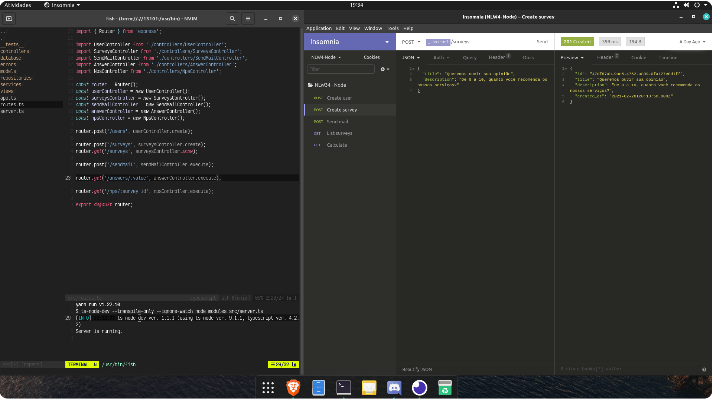

<h1 align="center">Next Level Week #4 - Trilha NodeJS</h1>


## Sobre o projeto



Uma api para envio de emails de avaliação e cálculo de NPS.

---

## Tecnologias utilizadas

Esse projeto foi desenvolvido utilizando as seguintes tecnologias abaixo:

- NodeJS + Express
- TypeScript
- TypeORM
- Jest

---

## Para rodar a aplicação:

```shell
  $ yarn install
  $ yarn dev
```

---

## Para criar o Banco de Dados

```shell
yarn typeorm migration:run
```

---

## Como contribuir

- Crie um fork deste repositório
- Faça uma branch com a sua feature: `git checkout -b minha-feature`;
- Envie suas alterações: `git commit -m 'feat: Minha nova feature'`;
- Faça um push para a sua branch: `git push origin minha-feature`.
